# PARUS GUI

Two major workflows of PARUS system, `Model Traing` and `Data Processing`, are provided in two central GUIs.

> **Note:** All GUIs automatically save the most recently used parameters after a successful run, 
> making repeated tasks faster and more convenient.

---

---

## Model Training

The PARUS model training workflow consists of **three main stages**, accessible through a central GUI.
The main interface guides users through the pipeline in the correct order.

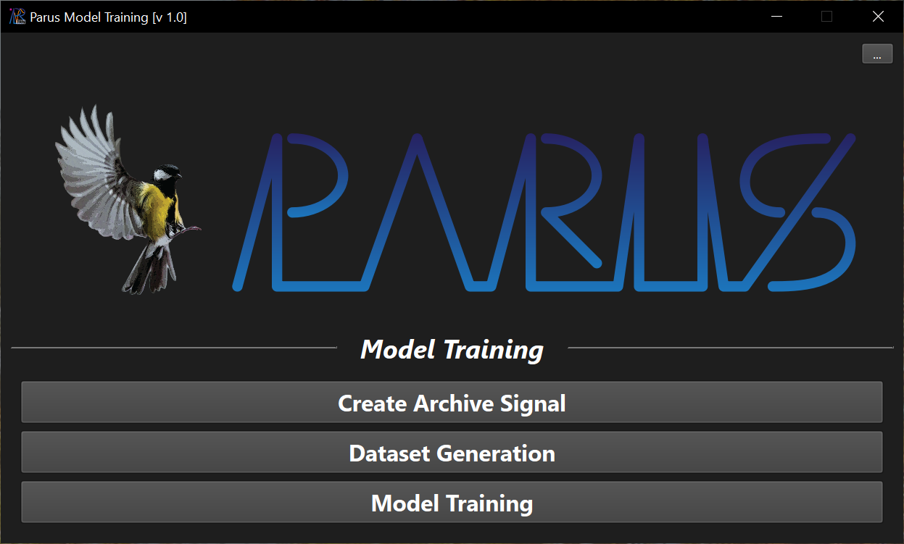

The main interface also allows you to configure:

- The **application working directory**
- The **colour mode** (e.g., light or dark mode)

---

## 1. Create Archive Signal

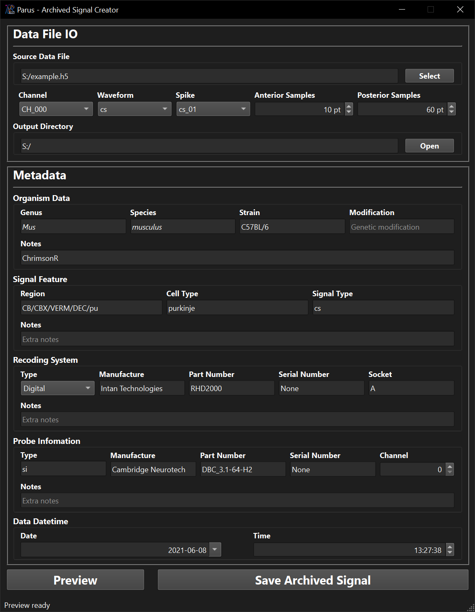

### Data Input

In the `Data File IO` panel, select an **annotated spike trace file** generated by:

- The PARUS system, or
- Any compatible external system (see [`FORMAT.md`](FORMAT.md))

After selecting a file, configure:

- `Channel`
- `Waveform`
- `Spike`
- `Anterior Samples` (before spike peak)
- `Posterior Samples` (after spike peak)

### Processing Steps

The **Archive Signal** is generated through the following steps:

1. Align spike peaks to their local extrema
2. Extract signal frames using the specified sample window
3. Compute the **mean** or **median** across aligned frames

Use the `Preview` button to visualize the result and fine-tune parameters.

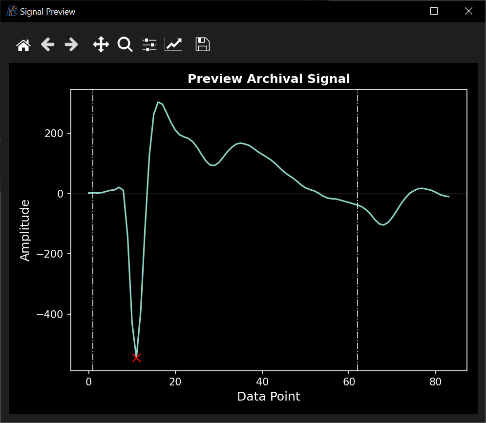

> **Tip:** If `Waveform` and/or `Spike` are not specified, 
> the system will generate an **Archive Noise** file (`*.noi`) instead.

### Metadata

In the `Metadata` panel, enter all relevant experimental details.

Once all required fields are completed, the `Save Archive Signal` button will be enabled 
to generate an **Archive Signal** file (`*.sig`).

---

## 2. Dataset Generation

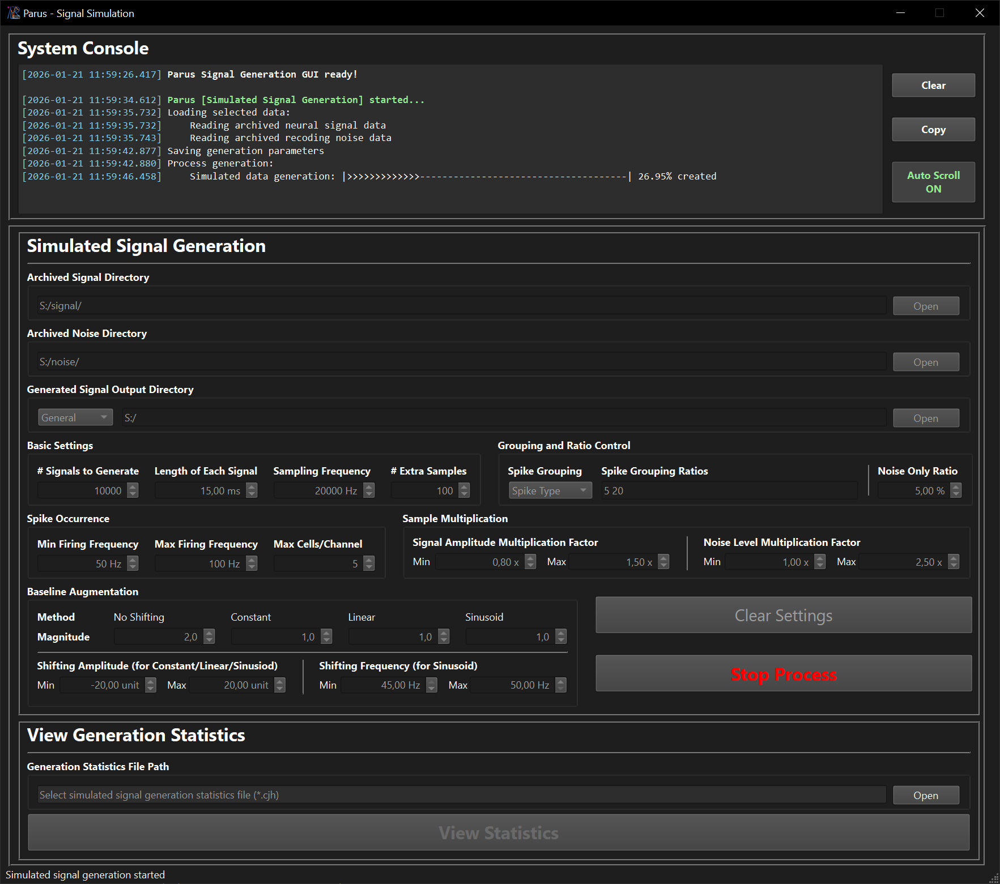

After collecting sufficient **Archived Signal** and **Archived Noise** files, 
you can generate a simulated dataset for model training.

### Dataset Preparation

Before proceeding, it is recommended to split your data into three groups:

- **Training Set**
- **Validation Set**
- **Testing Set**

A typical ratio is **3:1:1**, with **no overlap between sets** to ensure valid model evaluation.

### Configuration

In the `Simulated Signal Generation` panel, define generation parameters:

#### Output Directory

- `[TYPE]`: Select dataset type (`Training`, `Validation`, `Testing`)
  - Use `General` to test the generation process
- `[PATH]`: All dataset types must be stored in the **same directory** for full training

#### Explanation of Less Intuitive Parameters

- `# Extra Sample`  
  Generates additional samples to improve model robustness and ensure coverage of edge cases
- `Spike Grouping Ratios`  
  Defines relative proportions of spike groups
  - Order follows alphabetical group names
  - Values are space-separated
- `Baseline Augmentation` - `Magnitude`  
  Applies augmentation using combined magnitude values

### Execution

Once all parameters are set, click `Start Generation`.

- Progress is displayed in the `System Console`
- Logs can be copied for reference

After completion:

- A **generation statistics file** is saved in the output directory
- Results can be visualized in the `View Generation Statistics` panel

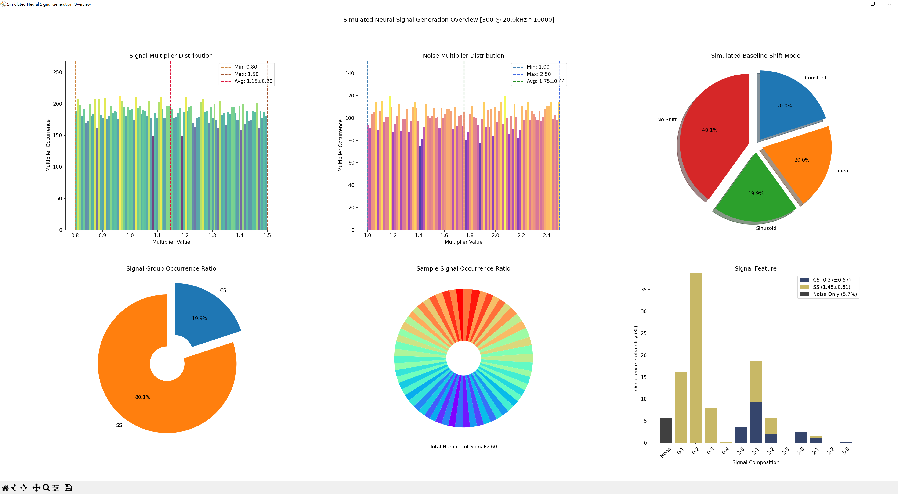

---

## 3. Model Training

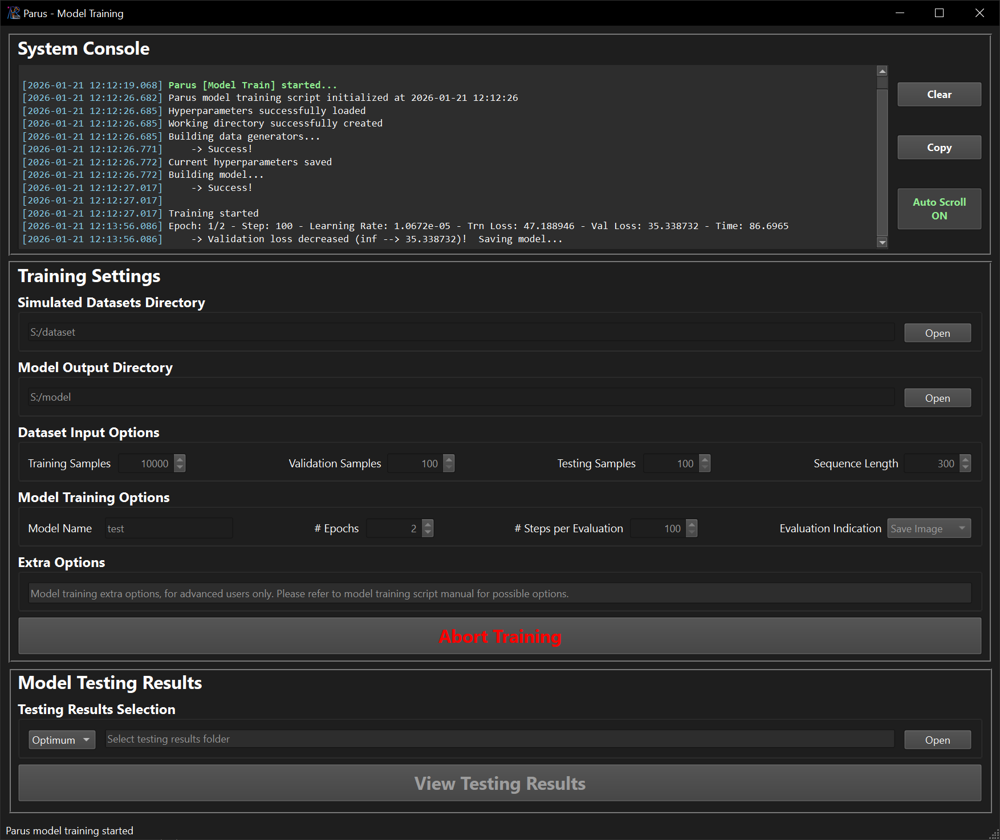

Once the datasets are ready, you can begin model training.

### Training Configuration

In the `Training Settings` panel, configure key hyperparameters.

> **Important:** `Sequence Length` must match the sample length used during dataset generation.

### Advanced Options

The `Extra Options` section allows advanced users to define additional hyperparameters via command-line-style inputs.
See [`CLI.md`](CLI.md) for full details.

### Execution

Click `Initiate Model Training` to start the process.

- Training progress is shown in the `System Console`
- Logs can be copied for analysis

### Outputs

After training completes, the following files are generated:

- `optimum.ckpt`: Model with the **lowest validation error**
- `final.ckpt`: Model from the **final training epoch**
- `tst_opt.pklz`: Test results using the optimum model
- `tst_fin.pklz`: Test results using the final model
- `hparams.json`: Hyperparameters used for model optimization
- `history.json`: Model optimization history record
- `train.log`: Model optimization history record in human-readable format
- `vld_ep*_stp*.png`: Saved model validation results during training if user set `Save Image` in `Evaluation Indication`

### Results Visualization

You can explore results (`tst_opt.pklz` and `tst_fin.pklz`) in the `Model Testing Results` panel:

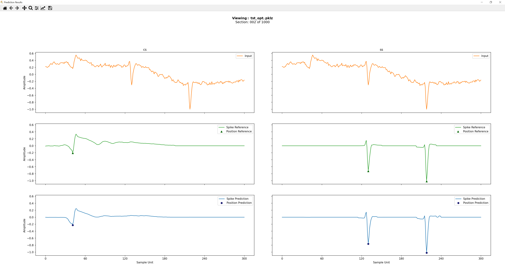

> **Tip:** Navigate between samples using the **arrow keys**

---

---

## Data Processing

The PARUS data processing workflow also consists of **three main stages**, accessible through a central GUI.
The main interface guides users through the pipeline in the correct order.

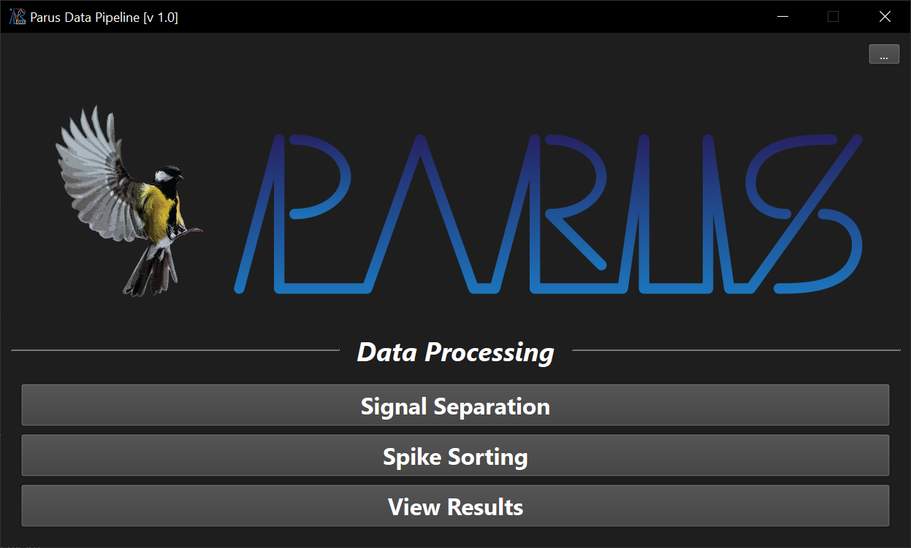

The main interface also allows you to configure:

- The **application working directory**
- The **colour mode** (e.g., light or dark mode)

---

### 1. Signal Separation (Model Inference)

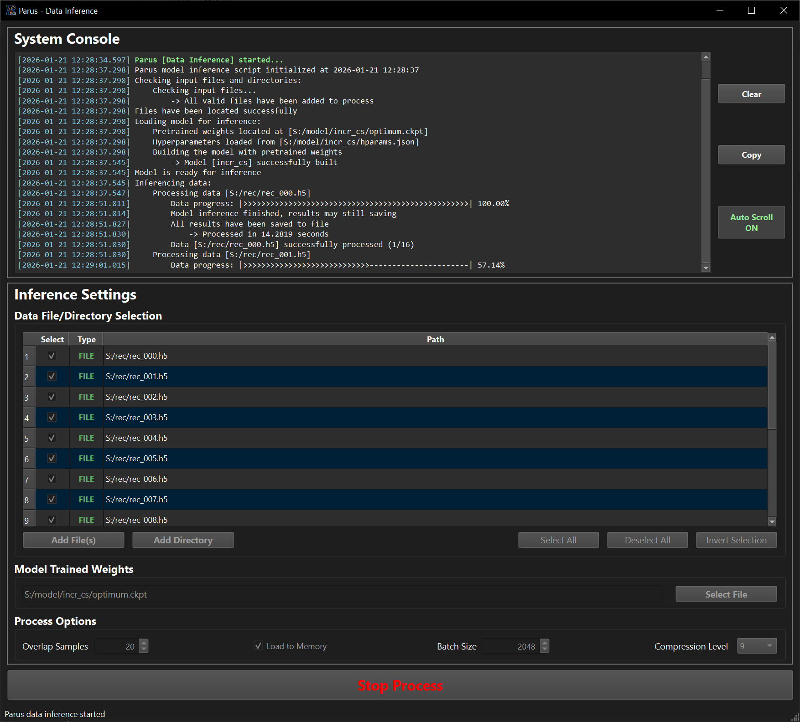

#### Data File / Directory Selection

Use this section to select input data:

- Click **Add File** to select individual files
- Click **Add Directory** to include all compatible files within a folder

Selected files will appear in a table, where you can still **select or deselect** them before processing.

#### Model Trained Weights

Specify the trained model file (`*.ckpt`) to be used for signal separation.

#### Process Options

- `Overlap Samples`  
  Number of samples shared between sliding windows. The window size is determined by the model’s sequence length.
  - Larger values are recommended for longer signals (e.g., complex spikes)
  - Should not exceed **half of the sequence length**
- `Load to Memory`  
  Loads the entire file into RAM before processing.
  - Improves performance for small files
  - May cause memory issues for large files
- `Batch Size`  
  Number of parallel processing operations.
  - Higher values typically improve GPU utilization and speed
  - Excessive values may reduce performance due to resource limitations
- `Compression Level`  
  Compression level of the output file using the HDF5 `gzip` algorithm.

#### Run Inference

Click `Initialize Data Inference` to start the process.

- Training progress is shown in the `System Console`
- Logs can be copied for analysis

---

### 2. Spike Sorting

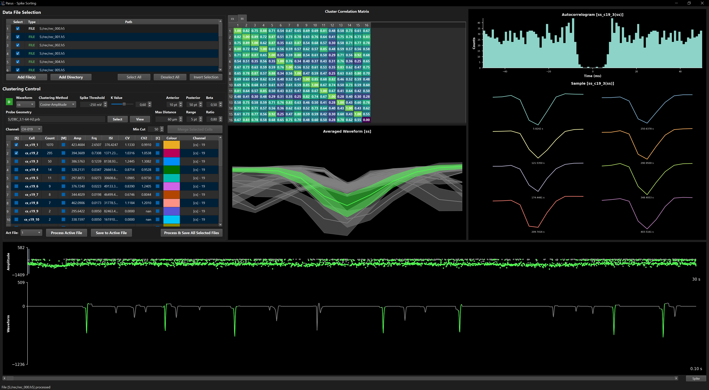

#### Data File Selection

Use this section to select input data:

- Click **Add File** to select individual files
- Click **Add Directory** to include all compatible files within a folder

Files are listed in a table, where they can be **selected or deselected**.

To choose the working file:

- Click a file in the table, or
- Select it from the `Act File` list

#### Cluster Control

Configure clustering parameters:

- `Waveform`  
  Select the waveform to configure. Each waveform (in multi-waveform models) can have independent settings.
- `Clustering Method`  
  Algorithm used for clustering spikes.
- `Spike Threshold`  
  Detection threshold, also acts as a signal filter.
  - Maximum value for negative peaks
  - Minimum value for positive peaks
- `K Value`  
  Cluster similarity threshold (range: 0–1):
  - `1` = identical
  - `0` = no similarity constraint
- `Anterior` / `Posterior`  
  Number of samples before and after the spike peak.
- `Beta`  
  Weight applied to spike amplitude (used as an exponent).
- `Grouping` *(multichannel probes only)*
  - `Probe File`: Load and visualize probe layout (see example below).
  - `Max Distance`: Maximum physical distance (in micrometer) between channels for grouping.
  - `Range`: Maximum time difference (in number of sample points) between spikes across channels.
  - `Ratio`: Minimum overlap ratio for cross-channel grouping.
- `Min Cut`  
  Minimum number of spikes required to form a valid cluster.

> **Note:** When parameters are modified, the status indicator changes from
> `U (yellow background)` → `D (green background)`

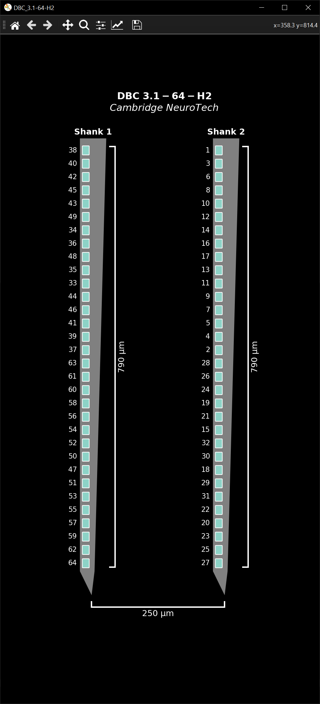

> **Tip:** If no `Probe File` is specified, channels will be processed independently, 
> even for multichannel recordings.

#### Processing

Once all parameters are configured, the `Process Active File` button becomes available.

After processing, several tables and visualizations assist with refinement.

#### Analysis Tools

- `Channel` Selector & `Cluster` Table  
  Provides an overview of detected clusters. Default naming conventions:
  - Single-channel: `[waveform ID]_c[channel #]_[cell #]`
  - Multi-channel: `[waveform ID]_mc_[cell #]`

  Includes statistics:

  - Spike count
  - Average amplitude
  - Firing frequency
  - Inter-spike interval (ISI)
  - CV and CV2

  Controls:

  - `[S]`: Mark cluster(s) for saving
  - `[M]`: Select clusters to merge (minimum 2)
  - `[C]`: Select up to 2 clusters for correlogram analysis
  - Click or Shift-click to highlight cluster(s)

- `Cluster Correlation Matrix`  
  Displays similarity between clusters to assist merging decisions.
- `Average Waveform` Plot  
  Shows mean waveform per cluster; highlights selected cluster(s).
- `Correlogram` Plot  
  Displays auto- or cross-correlograms for cluster validation.
- `Sample Signal` View  
  Shows signal segments across time or channels to assess drift.
- `Overview` Panel  
  Displays all and highlights selected cluster(s).
  - Signal trace (toggle between *Spike* and *Raw*)
  - Amplitude distribution

> **Tip:** Rename a cluster by double-clicking its name.
> For multichannel clusters, all associated names update simultaneously.

#### Saving Results

Click `Save to Active File` to store results for the current file.

> **Tip:** Use `Process & Save All Selected Files` to batch process multiple files with the current settings.

---

### 3. View Results

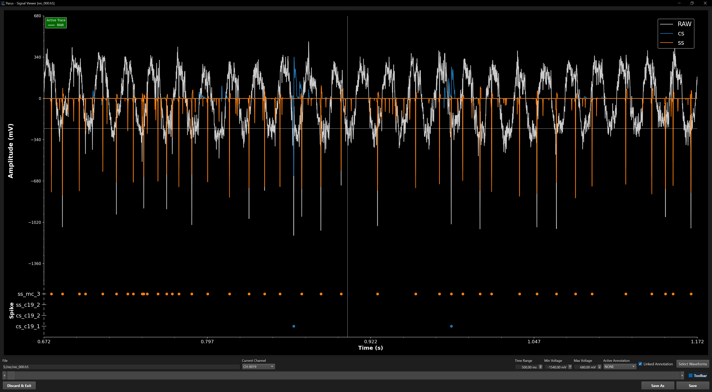

> **Note:** This tool can be used at any stage of the data processing pipeline.

This interface allows you to **visualize and manually edit spike data**.

#### Controls

  - `Current Channel`: Channel selector for multi-channel file
  - `Time Range`: Display range of X-axis
  - `Min Voltage`: Minimum value of Y-axis
  - `Max Voltage`: Maximum value of Y-axis
  - `Active Annotation`: Select working annotation
  - `Linked Annotation`: Auto-highlight annotation with corresponding waveform
  - `Select Waveform`: Choose waveform(s) to be plotted
  - `Toolbar`: Extra toolbar for panning, zooming and saving figure

#### Keyboard Shortcuts

**Navigation**

```
← / A / → / D           Navigate signal
    + Ctrl              Move slower
    + Shift             Move faster
    + Alt               Move fastest
```

**Channel Control**

```
Page Up / Page Down     Switch to adjacent channel
Alt + [Number]          Jump to specific channel
```

**Waveform Control**

```
Ctrl + [Number]         Toggle waveform visibility
```

**Annotation**

```
F1 - F12                Select annotation index
Left Click              Add a spike
Right Click             Remove a spike
```

**Cell Management**

```
Insert                  Add cell record
Delete                  Remove or restore active cell
```

**Help**

```
H                       Show help information
```

---

---

After all above steps, PARUS standard procedure finishes.
