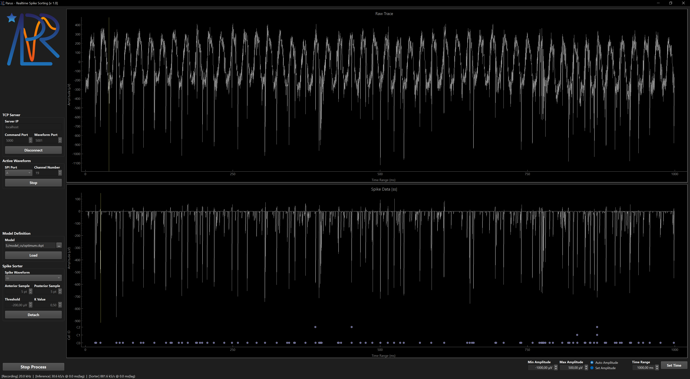

# PARUS Real-Time System

PARUS real-time system is a dedicated GUI developed for signal, process and status monitoring.

The data stream was duplicated at the **Open Ephys** controller and transmitted via TCP 
to the real-time processing system utilising a CUDA compatible GPU.

### Main GUI components

- `Acquisition Control Panel` (left top)  
  Configures the transmission control protocol (TCP) connection to the recording system.
- `Processing Control Panel` (left bottom)  
  Sets model and sorter processing options.
- `Raw Signal Plot` (top plot)  
  Displays raw data streamed from the recording system.
- `Sorted Spikes Plot` (bottom plot)  
  Shows the processed signals with automatically labelled cells.
- `Status Bar`  
  Continuously reports recording speed, processing speed, and system latency.

### Controls

- Amplitude Settings
  - `Min Amplitude`
  - `Max Amplitude`
  - `Auto Amplitude` / `Set Amplitude`
- Time Range Setting  
  Click `Set Time` button to update time range, this will also resize the `buffer` and `ring` sizes.
